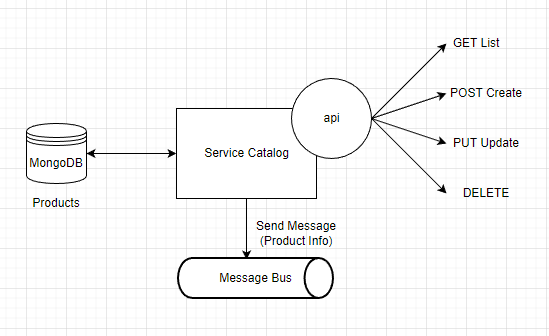

# ServiceCatalog
## Introduction
* Xây dựng 1 hệ thống đơn giản phục vụ cho việc quản lý sản phẩm đáp ứng các yêu cầu:
  - Sử dụng C#, .Net core version tùy ý
  - Áp dụng mô hình microservice (Tối thiểu 2 service)
  - Các service giao tiếp với nhau qua API và Service Bus (Azure Service bus hoặc RabbitMQ)
  - Kết nối với database MongoDB
  - Yêu cầu sử dụng 1 số design pattern trong project nếu có thể

* Services:
	- bao gồm 2 service (Web Api): Service Catalog và Service Inventory

## ServiceCatalog
### Information
Service Catalog là 1 web api, nhằm quản lý thông tin thông tin về sản phẩm (Product)

### Setup
* Packages
	- Azure.Messageing.ServiceBus
	- MongoDB.Driver
* Database: MongoDB
```bash
  "MongoDB": {
    "ConnectionURI": "<URL Connection>",
    "DatabaseName": "<Database Name>",
    "CollectionProductName": "<Collection Product>"
  },
```
* Message Bus: Azure Portal (Queue, Topic)
```bash
  "MessageBus": {
    "ConnectionString": "<Connection String>",
    "QueueName": "<Queue Name>"
  }
```

### Follow
<p align="center">
  
</p>